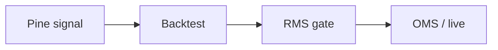

# Manuel H. — Data · AI · Quant Engineer

> I build **measurement systems for ads** and **execution systems for markets** — the same discipline (idempotent data, no lookahead, hard risk limits) applied to both.

Munich · [VollcomDigital](https://github.com/VollcomDigital) · [Docs portal](https://louisletcher.github.io/LouisLetcher/) · Python · BigQuery · Pine Script

I build **MarTech & AdTech data systems** professionally — first-party data platforms, server-side tracking, and measurement on Google Cloud — and bring the same rigor to **systematic trading** and **DeFi** infrastructure. Idempotent data, no lookahead, hard risk limits — in both.

---

## What I do

Most teams treat **ads measurement** and **trade execution** as separate worlds. I work at the overlap — where **attribution lag** looks a lot like **bar lag**, and **budget caps** look a lot like **position limits**. The hard parts are the same: delayed labels, leakage control, and capital allocation under uncertainty.

---

## 🛠 Work with me — clients

I turn messy data into systems that make decisions you can trust in production.

| Capability | What you get |
| --- | --- |
| **First-party data & activation** | GCP customer-data platforms, server-side tracking, CDP integration — GDPR/E-Privacy compliant |
| **Measurement & attribution** | server-side GTM/GA4, Google & Meta conversion APIs, consent management, recovering ITP/ETP signal loss |
| **Data platforms & pipelines** | BigQuery · Airflow · dbt — idempotent, tested, observable (OpenTelemetry tracing) |
| **ML / AI data foundations** | feature & training-data pipelines with leakage control and walk-forward validation |
| **Quant & execution infra** | backtesting, OMS/RMS, paper↔live parity, drawdown kill-switches |
| **Edge security** | Cloudflare Workers · WAF · Terraform for webhooks & APIs |

→ [**Start an engagement**](https://github.com/LouisLetcher/LouisLetcher/issues/new?template=collaboration.yml) · browse the [architecture docs](./docs/index.md) to see how I work before we talk.

---

## 📈 Partner & invest — systematic trading

A multi-asset platform built risk-first, not backtest-first.

- **Breadth** — 8+ market-data feeds behind a shared validation layer ([case study](./docs/case-studies/quant-system.md)).
- **Promotion discipline** — walk-forward → paper → live; **no** backtest-to-live shortcuts.
- **Hard limits** — rolling-drawdown kill-switch with manual re-arm, explicit position caps ([OMS / RMS design](./docs/architecture/oms-rms-kill-switch.md)).
- **Verified track record** — signed manifests, automated lookahead checks, timestamped audit trail — methodology in the open, alpha kept private ([integrity methodology](./docs/verified-track-record.md)).

→ Confidential inquiries via [LinkedIn](https://www.linkedin.com/in/manuelheck) · read the [verified track-record methodology](./docs/verified-track-record.md) first.

---

## Selected work

| | |
| --- | --- |
| **[quant-pine](https://github.com/LouisLetcher/quant-pine)** | Pine Script strategies & indicators — the public research layer for systematic trading |
| **[cloudflare-control-plane](https://github.com/LouisLetcher/cloudflare-control-plane)** | Edge security for webhooks & APIs — WAF, Workers, Terraform |
| **quant-system** *(private)* | Multi-asset platform: 8+ data feeds, backtesting, paper/live execution with OMS/RMS split → [architecture](./docs/architecture/quant-system-overview.md) · [open-core roadmap](./docs/open-core-roadmap.md) |

Further reading: [MarTech → Quant series](./docs/community/martech-to-quant.md) · [data-pipeline patterns](./docs/architecture/data-pipeline-patterns.md) · [signal marketplace](./docs/signal-marketplace.md)

---

## Experience

**Data / Web-Analytics & Tracking Engineer — [Vollcom Digital](https://github.com/VollcomDigital), Munich · since 2018**

| When | Engagement | Stack |
| --- | --- | --- |
| 2024–now | First-party data activation & server-side tracking for a **major European electronics retailer** — GDPR-compliant customer-data pipelines feeding personalized campaigns | GCP · BigQuery · server-side GTM · Cloud Functions · Airflow · dbt · Meta CAPI |
| 2020–2023 | Tag-management & web-tracking platform for the same retailer — server-side tracking to recover ITP/ETP signal loss, consent management | GTM · Tealium · OneTrust · Usercentrics · GA4 · BigQuery |
| 2019–now | Campaign data warehouse for a **global pharmaceutical company** — unifying Facebook / TV / web into one analytics layer | GCP · BigQuery · Airflow · ETL |
| 2018–2021 | CRM + web data warehouse for a **medical-technology manufacturer** — Salesforce / Zoho / web tracking into one reporting layer | GCP · Salesforce · Zoho CRM · Fivetran · Python |

**Certifications** — Google Cloud Professional Data Engineer · Google Tag Manager & GA4 Advanced (2024) · IBM Full-Stack JavaScript Developer · IBM DevOps & Software Engineering · IBM IT Project Manager
**Languages** — German (native) · English (business-fluent) · Spanish (basic)

---

## How I work

- **Idempotent data** — same inputs, same outputs; re-runs are bit-identical.
- **No lookahead** — feature timestamps ≤ decision time, enforced by automated checks.
- **Hard risk limits** — bankroll caps and kill-switches are code, not intentions.
- **Tested & observable** — typed Python, pytest coverage gates, OpenTelemetry tracing end to end.

This profile hub itself is built that way — see the [`profile_ops`](./tools/profile_ops/cli.py) tooling (link validation + weekly pulse) with lint, type-check, and CI gates.

---

## Stack

**Cloud & warehouses** — GCP (BigQuery, Pub/Sub, Cloud Functions, Kubernetes) · AWS · Azure · Snowflake · Redshift
**Pipelines & processing** — Apache Airflow · dbt · Spark / PySpark · Kafka · Fivetran · Polars · Pandas
**Measurement & CDP** — server-side GTM · Tealium · GA4 / Adobe Analytics · Segment · mParticle · Adobe RT-CDP · consent (OneTrust, Usercentrics) · GDPR / E-Privacy
**Infra & languages** — Terraform · Docker · Kubernetes · Python · SQL · JavaScript · Pine Script · Cloudflare Workers

---

## Activity

<!-- PULSE:START -->
See the [public changelog](./docs/CHANGELOG-PUBLIC.md) for weekly repository activity (auto-generated).
<!-- PULSE:END -->

---

## Connect

**Clients:** quant infra, data pipelines, attribution/measurement, or Pine Script — [open an engagement issue](https://github.com/LouisLetcher/LouisLetcher/issues/new?template=collaboration.yml).
**Investors & partners:** reach out on [LinkedIn](https://www.linkedin.com/in/manuelheck) for confidential conversations.

---

> "Data is a tool for empowerment, not just measurement."
