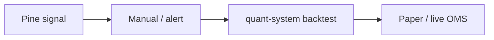

# Manuel H. · LouisLetcher

**Data Engineer** · MarTech / AdTech · Quantitative Trading · DeFi  
Munich · [@VollcomDigital](https://github.com/VollcomDigital)

Modular data pipelines, performance marketing measurement, and automated trading infrastructure — with institutional-grade risk controls.

---

## Proof

| Area | Public artifact |
| ---- | --------------- |
| TradingView research | [quant-pine](https://github.com/LouisLetcher/quant-pine) — Pine Script strategies & indicators |
| Edge / infra posture | [cloudflare-control-plane](https://github.com/LouisLetcher/cloudflare-control-plane) — Terraform + Workers |
| Quant platform (private) | [Architecture overview](./docs/architecture/quant-system-overview.md) · [Case study](./docs/case-studies/quant-system.md) |
| OMS / RMS / kill-switch | [Design note](./docs/architecture/oms-rms-kill-switch.md) |
| Writing | [Medium @louisletcher](https://medium.com/@louisletcher) |

---

## Projects

### [quant-pine](https://github.com/LouisLetcher/quant-pine) · Public

Pine Script strategies and indicators for TradingView — research front-end for algorithmic ideas.

| | |
| --- | --- |
| **Stack** | Pine Script v5/v6, TradingView |
| **Status** | Active · 19+ stars |
| **Deep dive** | [Signal marketplace map](./docs/signal-marketplace.md) |

---

### [cloudflare-control-plane](https://github.com/LouisLetcher/cloudflare-control-plane) · Public

Terraform-managed Cloudflare stack: email routing, WAF lockdown, Worker KV, deploy tooling.

| | |
| --- | --- |
| **Stack** | Terraform, Python, Cloudflare Workers |
| **Status** | Active |
| **Why it matters** | Webhook and API endpoints for trading bots need edge hardening |

---

### quant-system · Private ([VollcomDigital](https://github.com/VollcomDigital))

Multi-asset quant platform: 8+ data sources, modular strategies, backtesting, and live execution with OMS/RMS separation.

| | |
| --- | --- |
| **Stack** | Python, Docker, Makefile |
| **Access** | Private org repository |
| **Public docs** | [Overview](./docs/architecture/quant-system-overview.md) · [Open-core roadmap](./docs/open-core-roadmap.md) · [Case study](./docs/case-studies/quant-system.md) |

> Core alpha and live credentials remain private. Public documentation describes architecture and safety patterns only.

---

## Stack

Data engineering · ML / predictive modeling · BigQuery / dbt · AdTech (Google Ads, Meta, programmatic) · DeFi · Cloudflare edge

---

## Activity

<!-- PULSE:START -->
See [public changelog](./docs/CHANGELOG-PUBLIC.md) for weekly repository activity (auto-generated).
<!-- PULSE:END -->

---

## Connect

**Collaboration:** [Open a collaboration issue](https://github.com/LouisLetcher/LouisLetcher/issues/new?template=collaboration.yml) · [Portal / docs](https://louisletcher.github.io/LouisLetcher/)

---

## Background

Over the past decade I've led teams building scalable, data-driven advertising solutions across **Google Ads, Meta, and programmatic** ecosystems. Recent work focuses on **quantitative trading**, **DeFi**, and the measurement rigor that bridges MarTech attribution with execution systems.

→ [MarTech → Quant crossover series](./docs/community/martech-to-quant.md)

---

> “Data is a tool for empowerment, not just measurement.”
