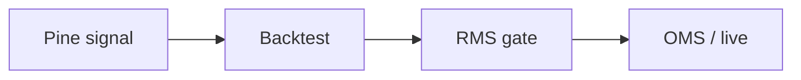

# Manuel H.

**Data engineer** building measurement systems for ads — and execution systems for markets.

Munich · [VollcomDigital](https://github.com/VollcomDigital) · Python · BigQuery · Pine Script

I spent a decade in **MarTech & AdTech** (Google Ads, Meta, programmatic) building attribution, pipelines, and ML for performance marketing. Now I apply that same rigor — idempotent data, no lookahead, hard risk limits — to **quantitative trading** and **DeFi** infrastructure.

**Public work:** [quant-pine](https://github.com/LouisLetcher/quant-pine) · [cloudflare-control-plane](https://github.com/LouisLetcher/cloudflare-control-plane) · [docs portal](https://louisletcher.github.io/LouisLetcher/)

---

## What I build

| | |
| --- | --- |
| **[quant-pine](https://github.com/LouisLetcher/quant-pine)** | Pine Script strategies & indicators — the research layer for systematic trading |
| **[cloudflare-control-plane](https://github.com/LouisLetcher/cloudflare-control-plane)** | Edge security for webhooks & APIs — WAF, Workers, Terraform |
| **quant-system** *(private)* | Multi-asset platform: 8+ data feeds, backtesting, paper/live execution with OMS/RMS split → [architecture docs](./docs/architecture/quant-system-overview.md) |

Most teams treat ads measurement and trade execution as separate worlds. I work at the overlap — where **attribution lag** looks a lot like **bar lag**, and **budget caps** look a lot like **position limits**.

→ [MarTech → Quant series](./docs/community/martech-to-quant.md) · [OMS / kill-switch design](./docs/architecture/oms-rms-kill-switch.md)

---

## Stack

BigQuery · dbt · Polars · ML / forecasting · DeFi · Cloudflare Workers

---

## Activity

<!-- PULSE:START -->
See [public changelog](./docs/CHANGELOG-PUBLIC.md) for weekly repository activity (auto-generated).
<!-- PULSE:END -->

---

## Connect

Quant infra, data pipelines, Pine Script, or MarTech measurement — [open an issue](https://github.com/LouisLetcher/LouisLetcher/issues/new?template=collaboration.yml) to start a conversation.

---

> “Data is a tool for empowerment, not just measurement.”
