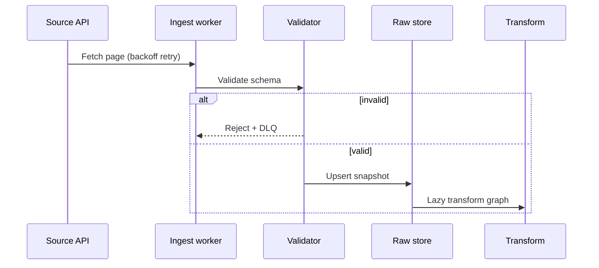

# Data Pipeline Patterns

Patterns used across MarTech analytics and quant data ingestion. Designed for **idempotency**, **replay**, and **zero lookahead**.

## Principles

1. **Boundary validation** — Every external row passes schema validation before entering the warehouse or backtest store.
2. **Point-in-time joins** — As-of semantics for fundamentals and corporate actions; no future columns in feature frames.
3. **Content-addressed snapshots** — Raw pulls keyed by `(source, symbol, interval, pull_ts)` with SHA-256 payload hash.
4. **Upsert > append-only duplicates** — Re-running a pipeline run produces identical downstream tables.

## Ingestion flow

## Lookahead bias prevention

| Anti-pattern | Guard |
| ------------ | ----- |
| Using adjusted close before adjustment date | As-of join on corporate action calendar |
| Training on full sample then "validating" on subset | Walk-forward with frozen hyperparams per window |
| Filling NaN with future values | Explicit ffill/bfill policy per feature; default **drop** at boundary |
| Leaking same-bar exit prices | Signal at bar *t* executes at bar *t+1* open (configurable lag) |

## MarTech parallel

Attribution pipelines use the same idempotent upsert model: impression/click streams → dedupe → sessionize → model features. Measurement lag mirrors **execution lag** in quant — both require explicit delay registers.

## Tooling

- **SQL:** BigQuery Standard SQL; CTEs only; no `SELECT *` in production models
- **Python:** Polars lazy(); Decimal or integer micros for money fields
- **Orchestration:** Stateless tasks; pass URIs not in-memory DataFrames

## Related

- [Quant system overview](./quant-system-overview.md)
- [OMS / RMS / kill-switch](./oms-rms-kill-switch.md)
