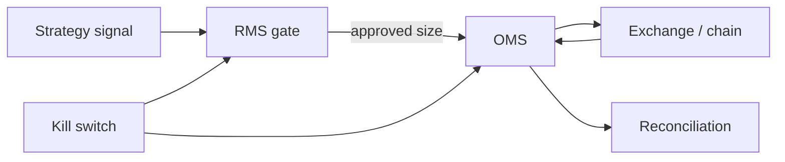

# OMS, RMS, and Kill-Switch Design

Institutional-grade live trading requires **hard separation** between signal generation, risk sizing, and order management. This document is the public safety contract for the quant-system execution stack.

## Architectural separation (mandatory)

| Layer | Owns | Must not |
| ----- | ---- | -------- |
| **Strategy** | Signal (−1, 0, +1) | Size positions, place orders |
| **RMS** | Sizing, exposure, bankroll, drawdown | Talk to exchange directly |
| **OMS** | Order placement, state, retries, reconciliation | Override RMS limits |
| **Kill switch** | Global halt + alert | Be bypassable by strategy code |

## Kill switch

- **Trigger:** Hard drawdown breach over rolling window (default: 24h)
- **Action:** Halt all new orders; cancel open orders where safe; emit **critical** alert
- **Recovery:** Manual ack + post-mortem required before re-arm

## Runaway loop prevention

- Query **real** exchange/chain state before every order (balances, positions, open orders)
- Cooldown and rate limits on order submission
- Block new orders when a market has unresolved pending/unfilled orders

## Price sanity and exits

- Validate spread, midpoint, and slippage bounds pre-trade
- Every entry registers an exit plan (SL/TP or time-based) in OMS before ack

## Paper / live parity

- Identical market-data feeds
- Only execution sink differs (record vs sign/send)
- Regime detection may **halt or reduce sizing** in extreme/unknown regimes

## Observability

Every order path emits OTel spans:

- `rms.evaluate_signal`
- `oms.place_order`
- `oms.reconcile`
- `kill_switch.evaluate`

Structured logs include `trace_id`, `strategy_id`, `symbol`, `intent`, `approved_notional`.

## Five-stage lifecycle gate

| Promotion step | RMS / OMS requirement |
| -------------- | --------------------- |
| Backtest → forward walk | No RMS bypass flags in code |
| Forward walk → paper | Kill switch armed; paper ledger reconciles daily |
| Paper → live | 30-day paper with <X bps slippage drift vs model |
| Live | Kill switch tested in staging within last 7 days |

## Related

- [Quant system overview](./quant-system-overview.md)
- [Verified track record](../verified-track-record.md)
