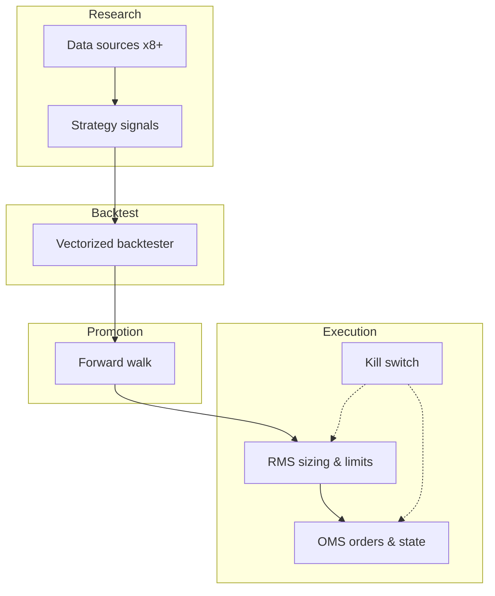

# Quant System — Architecture Overview

> **Classification:** Public, redacted overview. Live strategies, credentials, and alpha logic remain in the private `VollcomDigital/quant-system` repository.

## Problem

Build a modular platform that supports the full **quant lifecycle** without coupling research shortcuts to live capital risk.

## Five-stage lifecycle impact

| Stage | Component | Responsibility |
| ----- | --------- | -------------- |
| 1. Research | Strategy modules | Signal generation only (−1 / 0 / +1); no sizing |
| 2. Backtest | Vectorized engine | Isolated state; strict point-in-time data |
| 3. Forward walk | Walk-forward harness | Out-of-sample gates before promotion |
| 4. Paper | OMS + sim fill model | Live data parity; latency/slippage injection |
| 5. Live | OMS + RMS + kill-switch | Real execution; hard risk limits |

## Data layer

- **Sources:** Yahoo Finance, Alpha Vantage, and additional vendor adapters (8+ total)
- **Validation:** Pydantic / schema gates at ingestion boundaries
- **Storage:** Parquet-first; lazy Polars query graphs preferred over eager Pandas
- **Idempotency:** Upsert-by-key on pipeline runs; deterministic replay from raw snapshots

## Strategy layer

- Pluggable strategy interface; outputs **directional intent only**
- RMS owns position sizing, exposure caps, drawdown budgets
- No strategy module may call exchange APIs directly

## Observability

- OpenTelemetry traces on pipeline stages and order lifecycle
- Structured logs with `trace_id` correlation across OMS events
- Metrics: fill latency, slippage vs mid, reject rate, kill-switch activations

## Deployment

- Dockerized services; Makefile orchestration for local and CI parity
- Paper and live share identical market-data feeds; execution sink differs

## Related docs

- [Data pipeline patterns](./data-pipeline-patterns.md)
- [OMS / RMS / kill-switch](./oms-rms-kill-switch.md)
- [Case study](../case-studies/quant-system.md)
- [Open-core roadmap](../open-core-roadmap.md)
