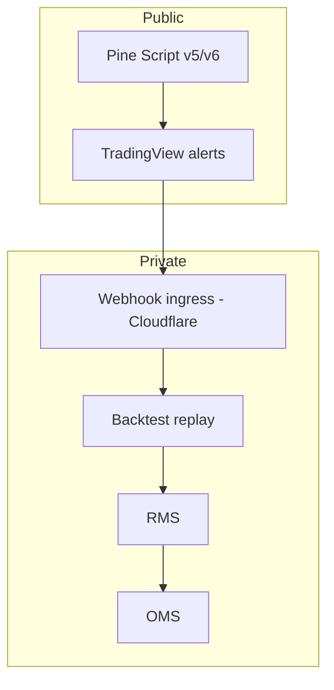

# Signal Marketplace — Pine → Python → Execution

Traceability map between public TradingView research and private execution infrastructure.

## Contract

| Layer | Repository | Output |
| ----- | ---------- | ------ |
| Research UI | [quant-pine](https://github.com/LouisLetcher/quant-pine) | Pine signal definitions, alerts |
| Backtest / validation | quant-system (private) | Historical performance, walk-forward gates |
| Execution | quant-system OMS | Sized orders, reconciliation |



## Versioning (quant-pine)

| Convention | Example |
| ---------- | ------- |
| Script folder | `strategies/<name>/` |
| Version tag | `v1.2.0` git tag per published script |
| Changelog | Entry per tag in repo CHANGELOG |
| TV compatibility | Badge: `Verified Pine v5` / `v6` |

## Alert payload schema (minimal)

```json
{
  "strategy_id": "momentum_rsi_v1",
  "symbol": "BTCUSD",
  "signal": 1,
  "bar_time": "2026-06-10T12:00:00Z",
  "script_version": "1.2.0"
}
```

- `bar_time` must be **≤** webhook receipt time (no future bars)
- Idempotency key: `(strategy_id, symbol, bar_time)`

## Edge ingress

Webhook endpoints are protected via [cloudflare-control-plane](https://github.com/LouisLetcher/cloudflare-control-plane): WAF rules, rate limits, KV-backed nonce store.

## Roadmap

- [ ] Public OpenAPI spec for webhook contract (redacted auth)
- [ ] Auto-generated mapping table: Pine script ↔ quant-system module
- [ ] Paper-trade dashboard link from quant-pine README

## Related

- [Open-core roadmap](./open-core-roadmap.md)
- [OMS / RMS / kill-switch](./architecture/oms-rms-kill-switch.md)
